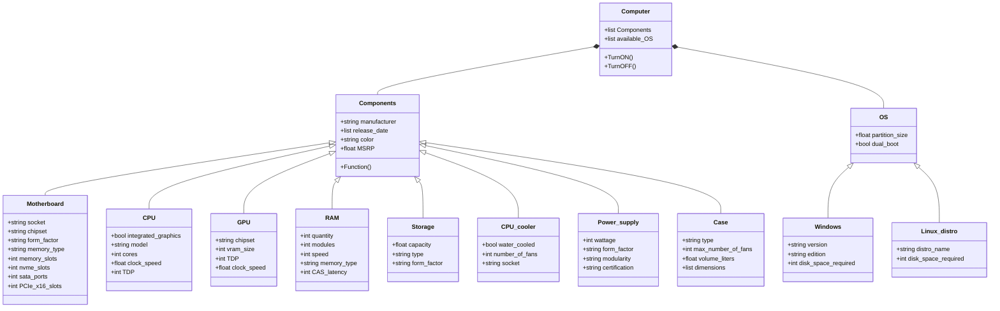

# RETO_2
Diagrama de clases de un computador
En este diagrama, dividí el computador en 2 clases, componentes y sistema operativo, estos a su vez tienen sus propias clases y atributos.

P.D. Cada clase tiene un constructor para que cada objeto pueda usar valores distintos y definirse de manera distinta

